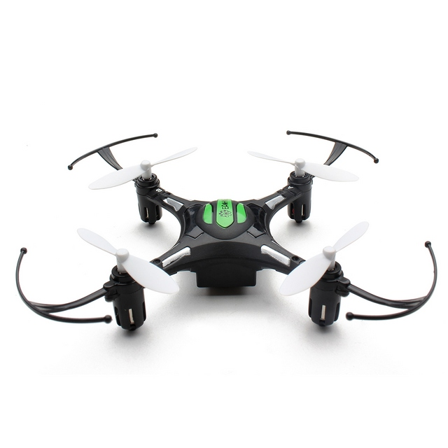

# neudron-core

Control a toy quadcopter from a smartphone or tablet over WiFi with NRF24L01+, Arduino and ESP8266.

Neudron ("New drone") folder contains the code for the Arduino, which will talk to the drone using NRF24L01+. 

Neuwei ("New way") contains code for the ESP8266 that will be used as a web interface, websocket server and also as a serial to HTTP adapter.

This code is currently compatible with the following quadcopter model(s): 
 - Eachine H8 mini ([https://bit.ly/2FNICHA](https://bit.ly/2FNICHA))

## Instructions

1. Upload Neudron to Arduino Nano
2. Upload Neuwei to ESP8266 development board
3. Connect NRF24L01+ to Arduino Nano
4. Connect Arduino to ESP8266 board
5. Power ESP8266 using micro USB
6. Connect to Neudron-FFFFF network with password neudron1234. 
7. Open 192.168.1.1 in browser

## Wiring diagram
[coming soon]

## Contributing
You are welcome to contribute new protocols and improve the code. Please make sure to thorougly test your code before submitting a pull request. 

## Acknowledgements
The neudron-core project is based on the work of [goebish](https://github.com/goebish) and some code has been utilised according to its license.

## Tutorial
[coming soon]